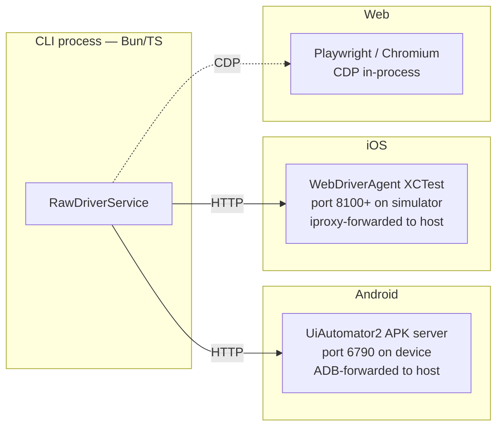

All platform interaction in prov flows through the `RawDriverService` interface. Platform-specific drivers implement this interface as thin HTTP clients. No selection logic, no auto-wait, no retry — just raw platform calls.

## RawDriverService interface

```ts
interface RawDriverService {
  tapAtCoordinate(x: number, y: number): Effect.Effect<void>;
  swipe(direction: Direction, opts?: { duration?: number }): Effect.Effect<void>;
  inputText(text: string): Effect.Effect<void>;
  pressKey(key: string): Effect.Effect<void>;
  hideKeyboard(): Effect.Effect<void>;
  dumpHierarchy(): Effect.Effect<RawHierarchy>;
  launchApp(appId: string, opts?: LaunchOptions): Effect.Effect<void>;
  stopApp(appId: string): Effect.Effect<void>;
  killApp(appId: string): Effect.Effect<void>;
  clearAppState(appId: string): Effect.Effect<void>;
  openLink(url: string): Effect.Effect<void>;
  back(): Effect.Effect<void>;
  takeScreenshot(): Effect.Effect<Uint8Array>;
}
```

The Smart Layer (`coordinator.ts`, `auto-wait.ts`, `element-matcher.ts`) is the only consumer of this interface. Flow authors never interact with it directly.

## Driver architecture



## Web driver (Playwright)

The web driver uses [Playwright](https://playwright.dev)'s CDP API in-process. No separate server is involved.

- Playwright is a dev dependency — no companion binary to install or manage.
- The driver launches a Chromium instance, navigates to `apps.web.url`, and exposes the page via the `RawDriverService` interface.
- `dumpHierarchy()` uses Playwright's accessibility tree snapshot and returns it as structured JSON.
- Coordinate taps are issued via `page.mouse.click(x, y)`.

## Android driver (UiAutomator2)

The Android driver is a pure HTTP client that talks to the UiAutomator2 APK server running on the device.

**Setup sequence:**
1. prov pushes the bundled UiAutomator2 APK to the device via ADB if not already installed.
2. It starts the server on the device (port 6790).
3. ADB port-forwarding maps device port 6790 to a local port.
4. The driver sends HTTP requests to `http://localhost:<forwarded-port>`.

**Key endpoints:**
- `GET /source` — returns the full UI hierarchy as XML
- `POST /touch/perform` — performs a touch action at coordinates
- `POST /appium/app/launch` — launches the app by package name

The driver parses the XML hierarchy in TypeScript and produces the unified `Element` tree. No XML parsing happens in the APK.

## iOS driver (WebDriverAgent)

The iOS driver is a pure HTTP client that talks to the WebDriverAgent (WDA) XCTest bundle running on the simulator or device.

**Simulator setup:**
1. prov installs the bundled unsigned WDA bundle into the simulator.
2. It launches WDA (which starts an HTTP server on port 8100+).
3. The driver sends HTTP requests to `http://localhost:8100`.

**Device setup:**
1. The WDA bundle must be re-signed with a user development certificate via `codesign`.
2. `iproxy` forwards the device port to a local port.
3. The driver connects to the forwarded port.

**Key endpoints:**
- `GET /source` — returns the full accessibility tree as JSON or XML
- `POST /session/:id/element/:id/click` — taps an element
- `POST /wda/touch/perform` — performs a touch at coordinates

## Hierarchy parsing

Each platform returns a different hierarchy format:

| Platform | Format | Parser location |
|---|---|---|
| Android | XML (UiAutomator ViewHierarchy) | `src/drivers/uiautomator2/parser.ts` |
| iOS | JSON (WDA accessibility tree) | `src/drivers/wda/parser.ts` |
| Web | JSON (Playwright accessibility tree) | `src/drivers/playwright/parser.ts` |

All parsers output the same unified `Element` type:

```ts
interface Element {
  role?:                string;
  testID?:              string;
  text?:                string;
  accessibilityLabel?:  string;
  bounds:               { x: number; y: number; width: number; height: number };
  children:             Element[];
}
```

`element-matcher.ts` in the Smart Layer searches this tree for the selector — no platform-specific code required.
