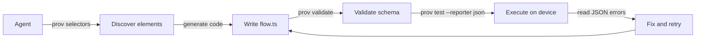

prov includes three commands designed specifically for AI agent-driven test authoring. They allow an agent to inspect the current UI state, generate flows, and validate them without needing a device connection.

## `prov selectors`

List all actionable elements on screen with suggested selectors.

```bash
prov selectors --platform <platform> [--pretty]
```

Output is a JSON array. Each entry describes a visible, interactable element and includes the best-priority selector to use in a flow file.

```bash
prov selectors --platform android
```

```json
[
  {
    "testID": "login-button",
    "text": "Sign In",
    "accessibilityLabel": null,
    "bounds": { "x": 24, "y": 480, "width": 328, "height": 48 },
    "suggestedSelector": { "testID": "login-button" }
  },
  {
    "testID": null,
    "text": "Forgot password?",
    "accessibilityLabel": null,
    "bounds": { "x": 120, "y": 544, "width": 136, "height": 20 },
    "suggestedSelector": { "text": "Forgot password?" }
  }
]
```

`suggestedSelector` follows priority: `testID` > `accessibilityLabel` > `text`. Feed this output directly to an agent to choose which element to interact with.

### Filtering with `jq`

```bash
# Elements that have a testID
prov selectors --platform web | jq '.[] | select(.testID != null)'

# Just the suggested selectors
prov selectors --platform ios | jq '[.[].suggestedSelector]'
```

## `prov hierarchy`

Dump the full UI element tree as structured JSON.

```bash
prov hierarchy --platform <platform> [--pretty]
```

Returns the complete accessibility tree for the current screen state — every element, including non-interactable ones.

```bash
prov hierarchy --platform web --pretty
```

```json
{
  "role": "application",
  "children": [
    {
      "role": "main",
      "children": [
        {
          "role": "textbox",
          "testID": "email-input",
          "text": "",
          "bounds": { "x": 24, "y": 200, "width": 328, "height": 44 }
        }
      ]
    }
  ]
}
```

Use `prov hierarchy` when `prov selectors` does not include the element you need, or to understand the structural relationship between elements.

## `prov validate`

Validate flow files for schema correctness without a device connection.

```bash
prov validate [path]
```

`path` defaults to `flowDir`. Exits `0` if all flows are valid, non-zero if any flow fails schema validation. Does not execute the flows.

```bash
prov validate flows/checkout.ts
# OK: flows/checkout.ts — 1 flow

prov validate
# OK: flows/login.ts — 1 flow
# OK: flows/checkout.ts — 2 flows
# ERROR: flows/broken.ts — export default is not a FlowDefinition
```

Use `prov validate` in CI preflight or as part of an agent loop before committing generated flow files.

## Agent workflow

The typical agent-driven authoring loop:

```bash
# 1. Navigate the app to the screen you want to test, then discover elements
prov selectors --platform android | jq '.[] | select(.testID != null)'

# 2. Generate and write a flow file (done by the agent)

# 3. Validate the flow without a device
prov validate flows/my-new-flow.ts

# 4. Run the flow and capture JSON results
prov test flows/my-new-flow.ts --reporter json 2>&1

# 5. Read errors from JSON output and iterate
prov test flows/my-new-flow.ts --reporter json 2>&1 | jq '.results[] | select(.status == "failed")'
```

This loop requires no manual interaction. `prov validate` catches structural errors before device time is spent. `--reporter json` gives the agent machine-readable pass/fail data with error messages.


